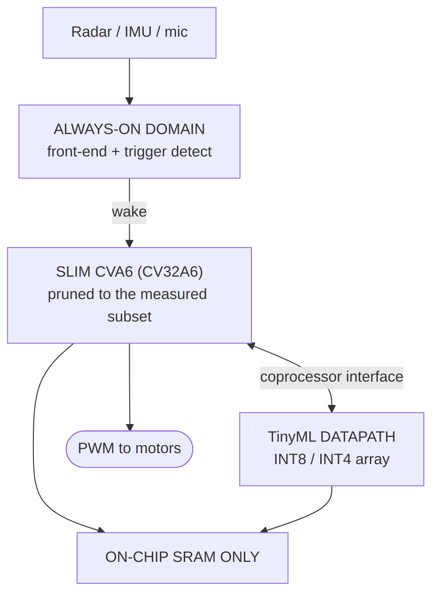

<!-- Project charter. Requirements state what must be true of the result;
     reference sections state one way to achieve it. Keep the two labelled. -->

<div align="center">

# CARVE-V

### Core Area Reduction by Verified Elimination

**A workload-driven ISA subsetting flow for CVA6, taped out as an always-on micro-UAV perception SoC.**

[](LICENSE)
[](LICENSE)
[](tools/isaprof/)
[](docs/)

</div>

> [!NOTE]
> **How to read this repository.** Each document states **requirements**
> (numbered `R-n.m` — what must be true) and then a **reference design** (one way
> to satisfy them). Requirements are deliberately abstract; the reference design
> is deliberately concrete and expected to be replaced. Where the team has
> measured data and the reference has estimates, the team's judgement wins.
>
> Two things are not open to revision: the deletion criterion in
> [`04`](docs/04-methodology-requirements.md) §2 and the compatibility obligation
> in [`05`](docs/05-compatibility-requirements.md) §1. Both fail in silicon,
> where nothing can be fixed.

---

## The one-sentence thesis

> Remove a large fraction of the implemented ISA from CVA6; prove the pruned
> core functionally equivalent on the surviving subset; retain full binary
> compatibility through trap-and-emulate; and spend the reclaimed silicon on a
> TinyML datapath — netting materially better inference energy in the same die
> area.

**Subtract, then reinvest.** Both halves are required. That is what separates
this from a configuration change.

---

## The trap this project is designed to avoid

"Disable the FPU and re-synthesise" is a week of work. It produces a smaller
core, a plausible graph, and one hard question at review:

> *Why didn't you just use Ibex, or X-HEEP? They're already small.*

There is no good answer to that if the contribution is a config file. So the
contribution is not the smaller core — it is the **automated, verified,
compatibility-preserving flow** that produces it, and the demonstration that the
reclaimed area buys something worth having. Three things follow:

| # | What matters | Why |
|:--:|---|---|
| **1** | **Deletion is driven by measured evidence**, not by which blocks look large | Any team can name the FPU. The long tail — base integer opcodes, CSRs, compressed subsets — is where a method is needed, and where intuition fails. |
| **2** | **Removed instructions keep working** | Every removed encoding is emulated, so the part stays architecturally compliant. Smaller *and* still runs the binaries is a result; smaller because it runs less is a configuration. |
| **3** | **Every pruning step is formally equivalence-checked** against the baseline | The standard for silicon you are paying to fabricate, as opposed to silicon you are simulating. |

---

## The chip

An always-on autonomous micro-UAV perception node: obstacle avoidance from
**mmWave radar** point clouds, plus airframe health monitoring from IMU and
acoustic vibration.



The application is not decoration. It is what makes each deletion arguable
*from the workload* rather than from taste:

| Property of the workload | What it licenses |
|---|---|
| Quantised models, end to end | No floating point |
| Flight control needs deterministic loop latency | The MMU is a liability, not merely unused |
| Single application, single core | No virtual memory, no atomics |
| Networks fit in on-chip memory | No DRAM controller or PHY |
| Low-rate sensor ingest | No high-speed sensor PHY |

The last two are load-bearing. Camera-class vision would need multiple megabytes
of weights and a MIPI PHY, and both are outside reach for a first tapeout.
Choosing radar is what keeps the design inside a university MPW.

---

## What is in this repository

| Path | What it is |
|---|---|
| [`docs/`](docs/) | Requirements, reference design, acceptance criteria, recorded predictions |
| [`tools/isaprof/`](tools/isaprof/) | **Working.** Measurement and the reference policy, zero dependencies |
| [`rtl/`](rtl/) [`sw/`](sw/) [`verif/`](verif/) [`flow/`](flow/) | Scaffolding — each directory states what belongs in it |

### Documents

New to the project? [**`OVERVIEW.md`**](docs/OVERVIEW.md) condenses all twelve
documents into four pages.

| № | Document | Requirements | Reference design |
|:--:|---|---|---|
| **00** | [Problem statement](docs/00-problem-statement.md) | The problem, prior art, novelty claim | — |
| **01** | [Objectives and scope](docs/01-objectives-and-scope.md) | Objectives, scope, core target | — |
| **02** | [Application requirements](docs/02-application-requirements.md) | The SoC and its workload | §9 Architecture |
| **03** | [Core requirements](docs/03-core-requirements.md) | Core, pruning harness, reinvestment | §7 TinyML datapath |
| **04** | [Methodology requirements](docs/04-methodology-requirements.md) | **The deletion criterion** | §9 Subsetting method |
| **05** | [Compatibility requirements](docs/05-compatibility-requirements.md) | **The ISA contract** | §7 Contract design |
| **06** | [Verification requirements](docs/06-verification-requirements.md) | Compliance, cosim, formal, CI | §9 Verification strategy |
| **07** | [Implementation constraints](docs/07-implementation-constraints.md) | PDK-agnostic reporting | — |
| **08** | [Deliverables](docs/08-deliverables.md) | Artifacts and their dependencies | — |
| **09** | [Acceptance criteria](docs/09-acceptance-criteria.md) | How the work is judged | — |
| **10** | [References](docs/10-references.md) | Annotated bibliography | — |
| **11** | [Expected results and risks](docs/11-expected-results-and-risks.md) | — | Predictions and risks |

---

## Start here

The instrument runs immediately: no toolchain, no `pip install`, no PDK.

```bash
cd tools/isaprof
python3 -m unittest discover -s tests -t .

python3 -m isaprof static  tests/fixtures/sample.elf      --json s.json
python3 -m isaprof dynamic tests/fixtures/spike_trace.log --json d.json
python3 -m isaprof classify s.json d.json -o subset.json
```

For the whole specification in four pages, read
[`OVERVIEW`](docs/OVERVIEW.md). For the full chain, read
[`00`](docs/00-problem-statement.md) →
[`01`](docs/01-objectives-and-scope.md) →
[`02`](docs/02-application-requirements.md) →
[`09`](docs/09-acceptance-criteria.md).

---

## First deliverable

A **subsetting methodology** satisfying
[`docs/04`](docs/04-methodology-requirements.md) §§1–8, supported by a
measurement run over the target workload. §9 of that document gives a reference
method, and `isaprof classify` implements its policy. Adopting it unmodified is
permitted, but is a decision to state and check against your own workload
(R-4.22), not a default to inherit silently.

Before reading [`11`](docs/11-expected-results-and-risks.md), write down your own
predictions. Published predictions anchor, and D-11 asks how they fared.

---

## Two facts worth knowing before you start

**Do not begin from a stale CVA6.** The repository was restructured; a checkout
predating the `core/` layout and `config_pkg` will not match current
documentation. Start from current upstream and record the commit.

**Two popular "removals" remove nothing.** The hypervisor extension is disabled
by default and is 64-bit only, so a default 32-bit build has no such logic to
strip. CVA6 has no L2 in the core, so "remove L2 coherence" is not a saving.
Claiming area from either will not survive review.

---

## Licence

Apache-2.0 for documentation and tooling; Solderpad Hardware Licence 2.1 for
RTL. See [`LICENSE`](LICENSE).

---

<div align="center">

**[Documents](docs/) · [Contributing](CONTRIBUTING.md) · [isaprof](tools/isaprof/)**

</div>
