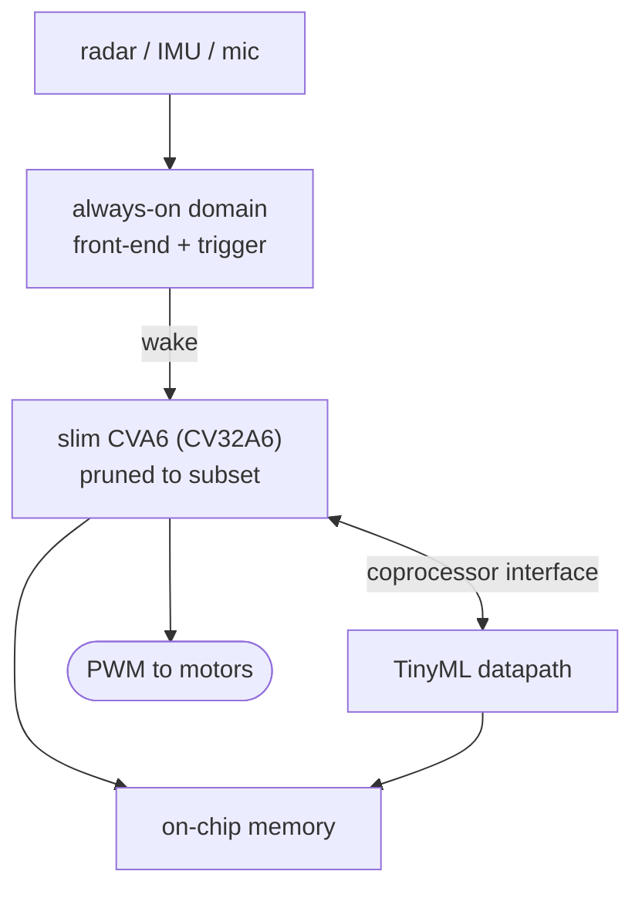

# 02 — Application Requirements

> [!NOTE]
> **§§1–8 are requirements** — what must be true of the device.
> **[§9](#9-reference-architecture) is reference guidance**, not a specification.

**Contents:**
[1. The device](#1-the-device) ·
[2. Why the application is a requirement](#2-why-the-application-is-a-requirement) ·
[3. Why radar rather than a camera](#3-why-radar-rather-than-a-camera) ·
[4. Memory](#4-memory) ·
[5. Architecture](#5-architecture) ·
[6. The closed loop](#6-the-closed-loop) ·
[7. Benchmark corpus](#7-benchmark-corpus) ·
[8. Evaluation metrics](#8-evaluation-metrics) ·
[9. Reference architecture](#9-reference-architecture)

---

## 1. The device

An always-on autonomous micro-UAV perception node: obstacle avoidance from
mmWave radar point clouds, and airframe health monitoring from IMU and acoustic
vibration. The chip is mounted on a drone frame and evaluated in flight.

---

## 2. Why the application is a requirement

Every deletion must be arguable **from the workload**, and an application chosen
after the fact cannot support the argument.

| Removal | Justification from this workload |
|---|---|
| Floating point | Models are quantised end to end |
| MMU / page-table walker | Flight control needs deterministic loop latency; page-walk and TLB-miss jitter are disqualifying, not merely unused |
| Atomics | Single hart, no SMP, no coherent memory |
| DRAM controller and PHY | Networks fit in on-chip memory |
| High-speed sensor PHY | Sensor ingest is low-rate |

The MMU row is the model to follow. "Unused" is a weak argument — an unused
block is merely wasteful. "Actively harmful to the timing guarantee the product
sells" is a strong one.

---

## 3. Why radar rather than a camera

The most consequential choice in the specification, and a feasibility judgement
rather than a preference. Camera-class vision does not close for two independent
reasons:

- **Weights.** A detector of that class needs multiple megabytes; a realistic
  on-chip budget for an MPW die is far smaller. Closing the gap requires
  off-chip DRAM, hence a DRAM PHY.
- **Ingest.** A camera stream needs a hard analogue PHY.

Both are mixed-signal blocks outside the scope set in
[`01`](01-objectives-and-scope.md) §4. Radar point clouds and IMU streams are
low-bandwidth and their networks are small enough to fit. **The demonstration
survives; the infeasibility does not.**

| ID | Requirement |
|:--:|---|
| **R-2.1** | Primary perception input MUST be mmWave radar, with IMU and acoustic vibration as secondary inputs. |
| **R-2.2** | No design element MAY require a mixed-signal PHY beyond what the scope permits. |
| **R-2.3** | Sensor ingest MUST be achievable over standard low-rate digital interfaces at the sensor's native rate. |

---

## 4. Memory

| ID | Requirement |
|:--:|---|
| **R-2.4** | All model weights and activations MUST reside in on-chip memory. |
| **R-2.5** | The memory budget MUST be derived from the measured footprint of the selected networks, and the derivation recorded. |
| **R-2.6** | The design MUST record measured worst-case activation working-set size, not only weight size. |

> **On R-2.6.** Weight size is the number everyone quotes and the one least
> likely to bind. Peak activation working set frequently exceeds it, and
> discovering that after the memory macros are placed is expensive.

---

## 5. Architecture

| ID | Requirement |
|:--:|---|
| **R-2.7** | The SoC MUST be duty-cycled: an always-on domain running the trigger detector, and a power-gated compute domain woken on trigger. |
| **R-2.8** | The compute domain MUST comprise the pruned core and a tightly-coupled TinyML datapath. |
| **R-2.9** | The design MUST provide the peripheral set the workload, the control loop and the bring-up plan require, justified against each. |
| **R-2.10** | The design MUST provide memory protection and a secure boot path. |
| **R-2.11** | Power domains, clock domains and reset topology MUST be documented before RTL freeze. |

---

## 6. The closed loop

| ID | Requirement |
|:--:|---|
| **R-2.12** | The design MUST report measured end-to-end sensor-to-actuator latency. |
| **R-2.13** | It MUST report worst-case observed jitter on that path, not only mean or median latency. |
| **R-2.14** | The latency budget MUST be allocated across the stages of that path before RTL freeze, and the measured result compared against the allocation. |

> **On R-2.13.** The argument for removing the MMU is a determinism argument,
> and an average latency figure is precisely the statistic that hides the tail
> the MMU was blamed for.

---

## 7. Benchmark corpus

Two corpora, serving different purposes. Both are required.

| Corpus | Purpose |
|---|---|
| **A — portable baselines** | Published embedded and TinyML benchmark suites, unchanged. These do **not** drive design decisions; they exist so results are citable against other people's silicon. |
| **B — target workload** | The actual application: the perception and anomaly-detection networks, quantised and constrained to the memory budget, together with the RTOS kernel, every interrupt service path, and the control loop. |

| ID | Requirement |
|:--:|---|
| **R-2.15** | Subsetting decisions MUST be driven by Corpus B only. |
| **R-2.16** | Corpus B MUST include the RTOS kernel and every interrupt service path, not only inference code. |
| **R-2.17** | Both corpora MUST be reported. |

> **On R-2.16.** Inference code is the well-behaved part of the workload and the
> part everyone profiles. Boot code, fault handlers, context switches and driver
> paths use instructions inference never touches — and they are where an
> instruction removed in error surfaces as a hang in the field rather than a
> failure on the bench.

---

## 8. Evaluation metrics

| ID | Metric |
|:--:|---|
| **R-2.18** | Energy per inference, and operations per watt |
| **R-2.19** | Inference throughput against power consumed |
| **R-2.20** | Worst-case closed-loop latency and jitter |
| **R-2.21** | Area in a normalised, PDK-independent unit |
| **R-2.22** | ISA coverage versus PPA, as a curve across configurations |
| **R-2.23** | Comparison against the unmodified baseline core and at least two independently-designed small RISC-V cores |

> **On R-2.22.** A curve, not a point. A single configuration answers "is it
> smaller"; a curve answers "what does each increment of ISA coverage cost",
> which is the question the project is about.

> **On R-2.23.** These baselines answer the *why not a small core* question with
> data instead of argument. Include them even if they are unflattering on raw
> area.

---

## 9. Reference architecture

> [!NOTE]
> **Reference guidance.** One way to satisfy §§1–8. Expected to be revised once
> measured.

### 9.1 Subtract, then reinvest

Subtraction alone produces a smaller core — a configuration change nobody needs
a tapeout to demonstrate. Reinvestment alone produces an accelerator SoC, of
which there are many. The combination produces the claim worth publishing:
*same die area, a large fraction of the ISA gone, materially better inference
energy, and the binaries still run.*

The framing also disciplines the engineering: every removal is answerable to
"what did the reclaimed area buy".

### 9.2 Block structure

### 9.3 Why RV32, not RV64

The originating proposal specified a 64-bit core. For a small address space, the
wider datapath, register file and ALU are pure cost, taken from the same budget
the FPU and MMU removals were meant to free. RV32 for tapeout; RV64 through the
same harness as a scaling study (R-1.2), so the claim is measured.

### 9.4 Two removals to strike from the pitch

Both appear in almost every first draft, and neither survives contact with the
source: the **hypervisor extension** is disabled by default and 64-bit only, so
a default 32-bit build contains none; and **L2 coherence** does not exist in the
core to remove. A reviewer who notices that half a removal list removes nothing
will discount the other half.

### 9.5 What was retained from the originating proposal

See [`prior-proposal.pdf`](prior-proposal.pdf). Its concreteness is a genuine
strength and is carried forward: a named FPGA prototype target, a staged
validation matrix, named custom instructions, and the physical demonstration —
die on a daughterboard, mounted on a drone frame, benchmarked as throughput
against power.

Its validation *metrics* are the part replaced: completing a benchmark is a
smoke test, not a tapeout gate (R-6.1). Its camera-based sensing and 64-bit
target are replaced for the feasibility reasons in [§3](#3-why-radar-rather-than-a-camera)
and [§9.3](#93-why-rv32-not-rv64).

---

| ← Previous | Index | Next → |
|---|:---:|---|
| [`01 — Objectives and Scope`](01-objectives-and-scope.md) | [`README`](../README.md) | [`03 — Core Requirements`](03-core-requirements.md) |
