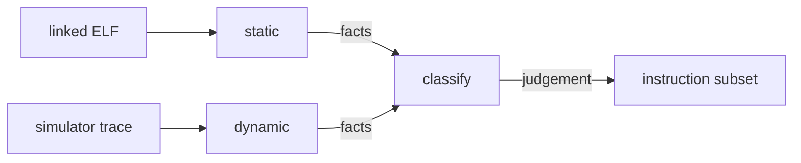

# 04 — Methodology Requirements and Reference Method

> [!IMPORTANT]
> **§§1–8 are requirements** — what must be true of the subsetting method.
> **[§9](#9-reference-method) is reference guidance**, not a specification.
>
> The one part that is not negotiable is
> **[§2 — the deletion criterion](#2-the-deletion-criterion)**, because getting
> it wrong is not recoverable in silicon.

**Contents:**
[1. What is being asked for](#1-what-is-being-asked-for) ·
[2. The deletion criterion](#2-the-deletion-criterion) ·
[3. Evidence and reproducibility](#3-evidence-and-reproducibility) ·
[4. Granularity](#4-granularity) ·
[5. Coverage](#5-coverage) ·
[6. Measurement discipline](#6-measurement-discipline) ·
[7. The instrument](#7-the-instrument) ·
[8. Deliverable](#8-deliverable) ·
[9. Reference method](#9-reference-method)

---

## 1. What is being asked for

A **reproducible procedure** that takes a workload and produces a defensible
instruction subset, plus the evidence that the procedure is sound.

Not a list of instructions. A list is an output; the assessable contribution is
the process that generated it and the argument for why that process is safe.

---

## 2. The deletion criterion

| ID | Requirement |
|:--:|---|
| **R-4.1** | The method MUST define an explicit deletion criterion, stated before it is applied. |
| **R-4.2** | The criterion MUST be conservative with respect to reachable code: no instruction the program can execute may be classified as removable. |
| **R-4.3** | The method MUST state its failure mode — what happens when the criterion is wrong — and argue why that failure mode is acceptable. |
| **R-4.4** | Absence from an execution trace MUST NOT, alone, justify removal. |
| **R-4.5** | Where the criterion over-approximates, the method MUST say so and quantify by how much. |

> [!CAUTION]
> **On R-4.2 and R-4.4.** An instruction a profiling run never executed is not
> an instruction that *cannot* execute: coverage is a property of the stimulus,
> not of the program. Fault handlers, error paths and allocation-failure
> branches appear in no healthy run and are all reachable. A method that treats
> "not observed" as "not present" produces a chip that works on the bench and
> hangs in the field.
>
> The criterion must be bounded by what the program *can* do. How that bound is
> established is your design decision.

> **On R-4.3.** An over-approximating criterion wastes area; an
> under-approximating one produces a broken chip. These are not symmetric, and
> the method must be explicit about which side it errs towards.

---

## 3. Evidence and reproducibility

| ID | Requirement |
|:--:|---|
| **R-4.6** | Every classification MUST trace to specific, recorded evidence. |
| **R-4.7** | The full pipeline — workload → evidence → classification → configuration — MUST be reproducible from a committed manifest. |
| **R-4.8** | The manifest MUST record enough to regenerate the result: sources, tool versions, inputs and invocations. |
| **R-4.9** | Re-running the pipeline on unchanged inputs MUST produce identical classifications. |
| **R-4.10** | The method MUST be re-runnable when the workload changes, without manual re-derivation. |

> **On R-4.10.** The workload will change — models get retrained, the RTOS gets
> updated, a driver gets rewritten. A method that requires a person to redo the
> analysis by hand is a one-off measurement wearing the costume of a flow.

---

## 4. Granularity

| ID | Requirement |
|:--:|---|
| **R-4.11** | The method MUST state the granularity at which it classifies, and justify the choice. |
| **R-4.12** | Where hardware granularity is coarser than classification granularity, the method MUST say how the mismatch is resolved. |

> **On R-4.12.** Hardware rarely divides where the ISA does. A single functional
> unit may implement several instructions, and removing one of them may save
> nothing unless the others go too. Conflating the two granularities produces
> predicted savings that synthesis does not deliver.

---

## 5. Coverage

| ID | Requirement |
|:--:|---|
| **R-4.13** | Evidence MUST cover the complete linked image: application, libraries, runtime, kernel, boot code, exception and interrupt paths. |
| **R-4.14** | The method MUST state how it handles code not present at analysis time. |
| **R-4.15** | Any excluded region MUST be listed with its justification. |

---

## 6. Measurement discipline

| ID | Requirement |
|:--:|---|
| **R-4.16** | Each configuration MUST be measured under identical flow, constraints and tool versions. |
| **R-4.17** | Results MUST be reported as a curve across configurations, not a single point. |
| **R-4.18** | Configurations that save nothing MUST be reported. |
| **R-4.19** | Where a saving is attributable to a structural change rather than an ISA change, the report MUST attribute it correctly. |

> **On R-4.19.** This is where a subsetting study most easily misleads, usually
> without intending to. If shrinking a cache and removing an extension happen in
> the same configuration, reporting the total under the ISA heading overstates
> the ISA result. Attribution is what distinguishes a measurement from a
> marketing figure.

---

## 7. The instrument

[`tools/isaprof/`](../tools/isaprof/) is provided, working, and dependency-free.
It performs three operations:

- **`static`** — a linear sweep of every allocated executable region of an ELF.
- **`dynamic`** — execution counts extracted from a simulator trace.
- **`classify`** — applies the reference policy of §9 to those measurements.

Measurement and policy are separate modules on purpose: `static` and `dynamic`
are facts, `classify` is a judgement, and the judgement is the part expected to
be replaced.

| ID | Requirement |
|:--:|---|
| **R-4.20** | The method MAY use the provided instrument, extend it, or replace it — but MUST justify the choice and MUST NOT rely on unstated behaviour. |
| **R-4.21** | If replaced, the substitute MUST satisfy every requirement in this document. |
| **R-4.22** | If the reference policy is used unmodified, that MUST be stated as a decision, with its assumptions checked against the actual workload. |

> **On R-4.22.** A default nobody examined is not a decision. The reference
> policy embeds assumptions that are correct for the application in
> [`02`](02-application-requirements.md) and may not be correct for a variant.

---

## 8. Deliverable

A methodology document containing:

- [ ] The deletion criterion, stated formally
- [ ] The soundness argument for R-4.2 and the failure-mode analysis for R-4.3
- [ ] The classification granularity and its justification
- [ ] The evidence pipeline and manifest format
- [ ] The configuration family the method produces
- [ ] Known limitations and the conditions under which the method does not apply

The last item is not a formality. A method with no stated limits has not been
examined closely enough to have found them.

---

## 9. Reference method

> [!NOTE]
> **Reference guidance.** One way to satisfy §§1–8. Adopt, adapt or replace —
> but read [§9.1](#91-two-criteria-two-purposes) first, because that part is not
> a preference.

### 9.1 Two criteria, two purposes

| | Static criterion | Dynamic criterion |
|---|---|---|
| **Question** | What *can* execute? | What *does* execute, how often? |
| **Source** | Linear sweep of the linked image | Simulator trace |
| **Bias** | Over-approximates | Under-approximates |
| **Governs** | **Deletion** | **Acceleration and emulation cost** |

**Deletion keys off the static criterion only. Frequency never justifies
removal.** The dynamic criterion answers a different question: what the
accelerator should target, and what emulation will cost — computable only from
frequency data.

The over-approximation is deliberate. A linear sweep decodes constant pools and
jump tables alongside real code, inflating the subset. The two errors are not
symmetric: over-approximating wastes area, under-approximating produces broken
silicon. Bias towards the recoverable error, then quantify the inflation
(R-4.5) and narrow the swept regions when it grows large.

### 9.2 Separating savings by mechanism

Group configurations so that savings can be attributed to a mechanism rather
than to a bundle of simultaneous changes (R-4.19). A workable split is:

| Tier | Mechanism | Expected character |
|:--:|---|---|
| **0** | Existing configuration knobs, no RTL change | Cheapest to implement, and predicted to deliver most of the area |
| **1** | New decoder-level parameters | Generates the headline ISA-reduction figure, and predicted to deliver the least silicon |
| **2** | Structural resizing and simplification | Highest effort and highest risk to timing closure, predicted second-largest |

Report the headline and the area together; they are routinely conflated.

### 9.3 Granularity and the mismatch problem

Classification granularity is the instruction; implementation granularity is the
functional unit. Removing one instruction from a shared unit usually saves
nothing — the unit remains, minus one decoder arm. Classify per instruction,
then group by implementing structure before predicting savings, and report at
group level.

### 9.4 The harness

A configuration layer over the core's existing parameter mechanism, never edits
to upstream RTL — editing upstream breaks the submodule pin, destroys
composability, and voids the equivalence proof against the baseline. Every
combination buildable, measurable and reversible. The output is not a chip; it
is a **curve**.

### 9.5 Shape of the procedure

Build the corpus, establish what the program can execute, rank what it does
execute, take the complement as removal candidates, group them by implementing
structure, price each group against its emulation cost, then generate, build and
measure the configurations. Record every nil result: a results table where every
intervention worked reads as unfalsified.

### 9.6 Why `absent` is not a verdict

The reference policy in one sentence: **reachability decides, frequency
prices.** Instructions on the real-time interrupt path are retained in hardware
regardless of the subset, because emulation cost is incompatible with the
determinism claim (R-5.12).

The obvious three-way split — keep / emulate / absent — is wrong. An instruction
outside the analysed image is outside the *analysed program*, not outside the
ISA, and the part may still meet it: a bring-up test, a third-party binary, a
recompilation after a toolchain upgrade. Covering that case is the compatibility
contract's job. **Two verdicts, not three.**

### 9.7 Where this method is weak

Stated because [§8](#8-deliverable) demands it, and a reference should meet its
own bar:

| Weakness | Detail |
|---|---|
| **Indirect jumps** | A linear sweep bounds what is *in* the image, not what is reachable. Acceptable here only because the target is a static, single-application bare-metal image. |
| **Externally supplied code** | Any post-fabrication binary not analysed at design time is outside the guarantee. The compatibility contract makes this survivable rather than fatal. |
| **Self-modifying code** | Out of scope; state it as an assumption rather than assuming it silently. |
| **Toolchain drift** | A compiler upgrade can introduce instructions the analysis never saw, so the pipeline must be re-runnable (R-4.10) and actually re-run. |

---

| ← Previous | Index | Next → |
|---|:---:|---|
| [`03 — Core Requirements`](03-core-requirements.md) | [`README`](../README.md) | [`05 — Compatibility Requirements`](05-compatibility-requirements.md) |
