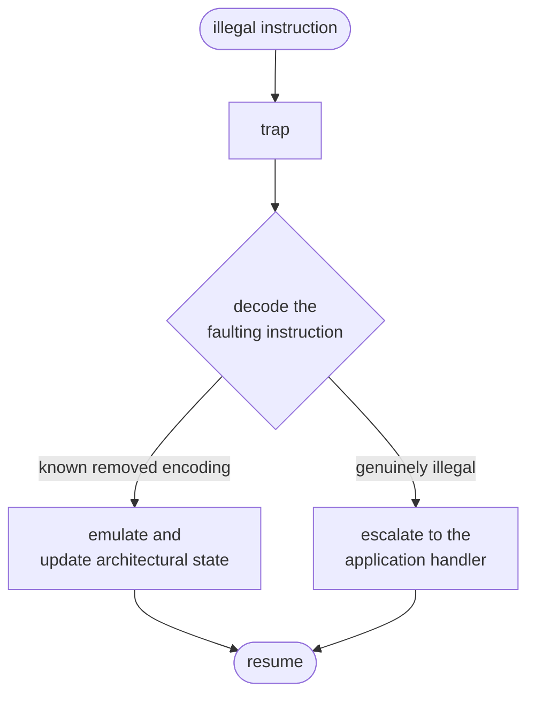

# 05 — Compatibility Requirements

> [!IMPORTANT]
> **§§1–6 are requirements** — the ISA contract.
> **[§7](#7-reference-contract-design) is reference guidance.**
>
> [§1](#1-the-obligation) is not open to revision. It fails in silicon, where
> nothing can be fixed.

**Contents:**
[1. The obligation](#1-the-obligation) ·
[2. Why this is the centre of the project](#2-why-this-is-the-centre-of-the-project) ·
[3. Correctness](#3-correctness) ·
[4. Cost](#4-cost) ·
[5. Compliance](#5-compliance) ·
[6. The contract document](#6-the-contract-document) ·
[7. Reference contract design](#7-reference-contract-design)

---

## 1. The obligation

**A removed instruction must still execute correctly.**

Not "the software is recompiled to avoid it". Not "our workload does not use
it". The instruction executes and produces architecturally correct results,
through emulation, at a measured cost.

| ID | Requirement |
|:--:|---|
| **R-5.1** | Every removed encoding MUST be handled by a trap handler that emulates it correctly. |
| **R-5.2** | With handlers installed, the part MUST be architecturally indistinguishable from a full implementation, except in timing. |
| **R-5.3** | Handlers MUST be provided as a library that can be linked into any application, not embedded in one runtime. |

---

## 2. Why this is the centre of the project

Without it, the deliverable is a core with fewer features, and off-the-shelf
alternatives already exist. With it, the claim becomes:

> *This is a legal RISC-V implementation from software's perspective. It runs
> the binaries. It just does so with a large fraction of the gates removed, at a
> measured and bounded cost.*

That converts "we removed features" into "we relocated the ISA across the
hardware/software boundary and measured the exchange rate" — which is the actual
intellectual content.

---

## 3. Correctness

| ID | Requirement |
|:--:|---|
| **R-5.4** | Handlers MUST produce results bit-identical to the hardware instruction, including all architectural side effects. |
| **R-5.5** | Flag, exception and CSR side effects MUST be reproduced exactly. |
| **R-5.6** | Emulation MUST be re-entrant and safe from interrupt context. |
| **R-5.7** | Handlers MUST be verified against a reference model, exhaustively where feasible and by directed plus randomised testing where not. |
| **R-5.8** | Nested traps — an emulated instruction that itself faults — MUST be handled and tested. |

> **On R-5.5.** Side effects are where emulation quietly fails. Getting an
> arithmetic result right is easy; reproducing the architecturally specified
> behaviour of the edge cases is where a handler diverges from hardware, and
> software finds out much later.

> **On R-5.6 and R-5.8.** After pruning, interrupt handlers will contain
> emulated instructions, so the emulator runs in interrupt context. Shared
> static state corrupts under nesting at a rate rare enough to be effectively
> undebuggable in silicon; nested traps are rare for the same reason, and
> therefore usually untested.

---

## 4. Cost

| ID | Requirement |
|:--:|---|
| **R-5.9** | Per-instruction emulation cost MUST be published alongside the measured frequency that gives it weight. |
| **R-5.10** | Whole-program slowdown MUST be measured on the target workload, not extrapolated from per-instruction costs. |
| **R-5.11** | The report MUST state plainly that trap-and-emulate is a compatibility guarantee and not a performance one. |
| **R-5.12** | Any instruction whose emulation cost is incompatible with the closed-loop latency budget MUST be identified, and MUST NOT be removed from a configuration used on the real-time path. |

> **On R-5.10.** Trap overhead is not a per-instruction constant. It interacts
> with pipeline state, cache behaviour and interrupt latency, so summing a table
> will understate it.

> **On R-5.12.** This is where the compatibility story meets the application
> story. Compatibility guarantees the instruction *works*; it does not guarantee
> it works *in time*, and the real-time path must be analysed separately.

---

## 5. Compliance

| ID | Requirement |
|:--:|---|
| **R-5.13** | The pruned core MUST pass an architectural compliance suite with handlers installed. |
| **R-5.14** | It MUST also be run without handlers, with every resulting failure documented and explained. |
| **R-5.15** | Both results MUST be published. Reporting only the passing configuration is not acceptable. |

> **On R-5.14 and R-5.15.** The bare run characterises the hardware; the handler
> run characterises the part. Both are true and they answer different questions,
> and the delta between them is the clearest quantification of what was moved
> into software.

---

## 6. The contract document

| ID | Requirement |
|:--:|---|
| **R-5.16** | A contract document MUST specify, for each removed encoding: what hardware does, what the handler does, the cost, and when the handler must be present. |
| **R-5.17** | It MUST state what happens if software runs without the handler library — the failure must be a clean, diagnosable trap, never silent misbehaviour. |
| **R-5.18** | Handlers MUST be installed before any application code runs, and their presence MUST be discoverable at runtime. |

> **On R-5.17.** Someone will eventually run a binary on this chip without the
> handler library. That case must fail loudly and legibly; a silent wrong answer
> is far worse than a clean crash, and on a flying device it is worse still.

---

## 7. Reference contract design

> [!NOTE]
> **Reference guidance.** One way to satisfy §§1–6.

### 7.1 Structure

A static library, linked by any application, with handlers installed by the boot
path before application entry (R-5.18).

> Resuming at the right address is a real bug source: the handler must derive
> instruction length from the encoding rather than assume a fixed width, or
> every emulated compressed instruction resumes mid-instruction.

### 7.2 Expected coverage

Removals that change the software-visible ISA need handlers — integer division
and remainder are the most likely candidates to be removed for real area, along
with dropped compressed subsets, removed CSR accesses and atomics if that
extension goes.

Removals that are not software-visible mostly need none: disabling an extension
changes the advertised ISA rather than breaking a promise, and structural
changes are invisible to software. Classify each removal on that axis (R-3.11);
being wrong in either direction is expensive.

### 7.3 The three failure modes

- **Side effects.** The edge cases, not the arithmetic, are where handlers
  silently diverge.
- **Interrupt-context re-entrancy.** Handlers must be pure functions of trap
  state.
- **Nested traps.** Rare, therefore usually untested, therefore the one that
  reaches the field.

### 7.4 Cost model

Publish one row per removed encoding: the encoding, its handler cost, its
measured frequency, and its contribution to whole-program slowdown. Frequency
comes from the dynamic pass — the second and equally legitimate use of trace
data, and the reason the dynamic criterion exists even though it must never
drive deletion.

Measure whole-program slowdown directly (R-5.10) rather than summing the table.

### 7.5 The real-time exception

Mean overhead will be small; worst-case interrupt-path latency will not be, and
that is the metric the application sells (R-2.13).

**Some instructions stay in hardware for latency reasons even when the subset
says they could go.** A retained instruction with a documented latency
justification is a stronger result than a removed one that breaks the
determinism claim, and the analysis identifying it is itself a contribution:
it quantifies where the hardware/software boundary cannot move.

---

| ← Previous | Index | Next → |
|---|:---:|---|
| [`04 — Methodology Requirements`](04-methodology-requirements.md) | [`README`](../README.md) | [`06 — Verification Requirements`](06-verification-requirements.md) |
