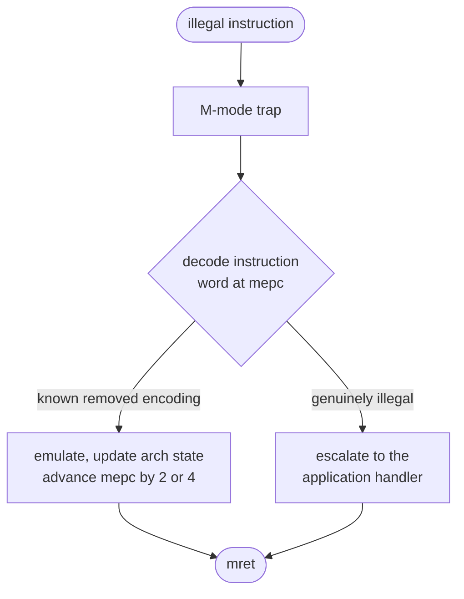

# 05 — Compatibility Requirements

> [!IMPORTANT]
> **Sections 1–6 are requirements** — the ISA contract.
> **[Section 7](#7-reference-contract-design) is a reference contract design**
> that satisfies them.
>
> **[§1 — the obligation](#1-the-obligation) is not open to revision.** It fails
> in silicon, where nothing can be fixed.

**Contents:**
[**1. The obligation**](#1-the-obligation) ·
[2. Why this is the centre of the project](#2-why-this-is-the-centre-of-the-project) ·
[3. Correctness](#3-correctness) ·
[4. Cost](#4-cost) ·
[5. Compliance](#5-compliance) ·
[6. The contract document](#6-the-contract-document) ·
[**7. Reference contract design**](#7-reference-contract-design)

---

## 1. The obligation

**A removed instruction must still execute correctly.**

Not "the software is recompiled to avoid it". Not "that instruction is not used
by our workload". **The instruction executes and produces architecturally
correct results**, through emulation, at a measured cost.

| ID | Requirement |
|:--:|---|
| **R-5.1** | Every removed encoding MUST be handled by an M-mode illegal-instruction trap handler that emulates it correctly. |
| **R-5.2** | With handlers installed, the part MUST be architecturally indistinguishable from a full implementation, except in timing. |
| **R-5.3** | Handlers MUST be provided as a library that can be linked into any application, not embedded in one runtime. |

---

## 2. Why this is the centre of the project

Without it, the deliverable is a core with fewer features. Every reviewer
already knows you can build one of those, and two of them are already available
off the shelf.

With it, the claim becomes:

> *This is a legal RISC-V implementation from software's perspective. It runs
> the binaries. It just does so with a large fraction of the gates removed, at a
> measured and bounded cost.*

That is a different and much stronger statement. It converts "we removed
features" into "we relocated the ISA across the hardware/software boundary and
measured the exchange rate" — which is the actual intellectual content.

---

## 3. Correctness

| ID | Requirement |
|:--:|---|
| **R-5.4** | Handlers MUST produce results bit-identical to the hardware instruction, including all architectural side effects. |
| **R-5.5** | Flag, exception and CSR side effects MUST be reproduced exactly. |
| **R-5.6** | Emulation MUST be re-entrant and safe from interrupt context. |
| **R-5.7** | Handlers MUST be verified against a reference model instruction-by-instruction, over the full input space where feasible and by directed plus randomised testing where not. |
| **R-5.8** | Nested traps — an emulated instruction that itself faults — MUST be handled and tested. |

> [!CAUTION]
> **On R-5.5.** Side effects are where emulation quietly fails. Getting `div`'s
> result right is easy; getting division-by-zero to produce the architecturally
> specified value rather than a trap is where a handler diverges from hardware and
> software finds out much later, in a way that looks like a compiler bug.

> [!CAUTION]
> **On R-5.6.** If an interrupt handler contains an emulated instruction — and
> after pruning it very likely does — the emulator runs in interrupt context. A
> handler using shared static state will corrupt itself under nesting, producing
> a fault that appears roughly once every few million interrupts and is
> effectively undebuggable in silicon.

> **On R-5.8.** An emulated load can page-fault. An emulated instruction can hit a
> breakpoint. The nested case is rare, which is exactly why it is usually
> untested.

---

## 4. Cost

| ID | Requirement |
|:--:|---|
| **R-5.9** | A per-instruction table MUST be published: encoding, handler cycle cost, measured dynamic frequency, and resulting whole-program slowdown. |
| **R-5.10** | Whole-program slowdown MUST be measured on the Corpus B workload, not extrapolated from per-instruction costs. |
| **R-5.11** | The report MUST state plainly that trap-and-emulate is a compatibility guarantee and not a performance one. |
| **R-5.12** | Any instruction whose emulation cost is incompatible with the R-2.12 latency budget MUST be identified, and MUST NOT be removed from a configuration used on the real-time path. |

> **On R-5.10.** Trap overhead is not a per-instruction constant. It interacts
> with pipeline state, cache behaviour and interrupt latency, and summing a table
> will understate it. Measure the program.

> [!IMPORTANT]
> **On R-5.12.** This is the requirement that connects the compatibility story to
> the application story. A device selling deterministic sensor-to-PWM latency
> cannot afford an unbounded trap on the control path. Compatibility guarantees
> the instruction *works*; it does not guarantee it works *in time*, and the
> real-time path must be analysed separately.

---

## 5. Compliance

| ID | Requirement |
|:--:|---|
| **R-5.13** | The pruned core MUST pass RISCOF / `riscv-arch-test` with handlers installed. |
| **R-5.14** | It MUST also be run **without** handlers, with every resulting failure documented and explained. |
| **R-5.15** | Both results MUST be published. Reporting only the passing configuration is not acceptable. |

> [!WARNING]
> **On R-5.14 and R-5.15.** The bare run is the honest characterisation of the
> hardware; the handler run is the honest characterisation of the *part*. Both are
> true and they answer different questions. Publishing only the flattering one
> invites the reader to assume you did — and the delta between the two is itself
> the clearest quantification of what was moved into software.

---

## 6. The contract document

| ID | Requirement |
|:--:|---|
| **R-5.16** | A contract document MUST specify, for each removed encoding: what hardware does, what the handler does, the cost, and the conditions under which the handler must be present. |
| **R-5.17** | It MUST state what happens if software runs **without** the handler library — the failure must be a clean, diagnosable trap, never silent misbehaviour. |
| **R-5.18** | The boot ROM MUST install handlers before any application code runs, and MUST make handler presence discoverable at runtime. |

> [!CAUTION]
> **On R-5.17.** Someone will eventually run a binary on this chip without the
> handler library — a bring-up test, a third-party image, a colleague who did not
> read the README. That case must fail loudly and legibly. A silent wrong answer
> is far worse than a clean crash, and on a flying device it is worse still.

---

## 7. Reference contract design

> [!NOTE]
> **Reference design.** One way to satisfy §§1–6.

### 7.1 Structure

`sw/emulation/` builds to a static library, linked by any application, with
handlers installed by the boot ROM before application entry (R-5.18).

> [!CAUTION]
> Advancing `mepc` by the instruction's *actual* length is a real bug source. The
> handler must re-derive length from the encoding rather than assume four bytes,
> or every emulated compressed instruction returns into the middle of the next
> one.

### 7.2 Expected coverage

Every Tier 1 removal (see [`04`](04-methodology-requirements.md) §9.2) needs a
handler:

| Removed | Note |
|---|---|
| `div`, `divu`, `rem`, `remu` | The most valuable, and the most likely to be removed for real area |
| Dropped compressed subsets | — |
| Removed CSR accesses | Read-as-zero or trap, per the contract |
| Atomics | If the A extension is dropped and any library still emits them |

Tier 0 and Tier 2 removals mostly need no handler: disabling the FPU changes the
advertised ISA rather than breaking a promise, and structural changes are not
software-visible.

> [!IMPORTANT]
> **Classify each removal by whether it is software-visible**
> ([R-3.11](03-core-requirements.md#3-what-may-be-removed)) — that classification
> determines the handler workload, and being wrong in either direction is
> expensive.

### 7.3 The three failure modes

<b>1 — Side effects</b>

Getting `div` to produce the right quotient is easy. Getting division by zero to
return the architecturally-specified value rather than trapping is where a
handler silently diverges, and where the resulting bug looks like a compiler
fault years later.

<b>2 — Interrupt-context re-entrancy</b>

After pruning, ISRs contain emulated instructions, so the emulator runs in
interrupt context. Shared static state corrupts under nesting, at a rate rare
enough to be effectively undebuggable in silicon. **Handlers must be pure
functions of trap state.**

<b>3 — Nested traps</b>

An emulated load can fault; an emulated instruction can hit a breakpoint. Rare,
therefore usually untested, therefore the one that reaches the field.

### 7.4 Cost model

Publish one row per removed encoding:

| Encoding | Mnemonic | Handler cycles | Dynamic frequency | Contribution to slowdown |
|---|---|---:|---:|---:|

Frequency comes from the dynamic pass — the second and equally legitimate use of
trace data, and the reason the dynamic criterion exists at all even though it
must never drive deletion.

> [!WARNING]
> Measure whole-program slowdown directly (R-5.10). **Do not sum the table:** trap
> overhead interacts with pipeline state, cache behaviour and interrupt latency,
> and the sum will understate it.

### 7.5 The real-time exception

Mean overhead will be small. Worst-case interrupt-path latency will not be, and
that is the metric the application sells
([R-2.13](02-application-requirements.md#6-the-closed-loop-requirement)).

> [!IMPORTANT]
> **Some instructions stay in hardware for latency reasons even when the subset
> says they could go.** A retained instruction with a documented latency
> justification is a stronger result than a removed one that breaks the
> determinism claim — and the analysis identifying it is itself a contribution,
> because it quantifies where the hardware/software boundary genuinely cannot
> move.

`isaprof classify` encodes this as its real-time-critical list. Check that list
against the actual interrupt paths rather than trusting it (R-4.22).

---

| ← Previous | Index | Next → |
|---|:---:|---|
| [`04 — Methodology Requirements`](04-methodology-requirements.md) | [`README`](../README.md) | [`06 — Verification Requirements`](06-verification-requirements.md) |
