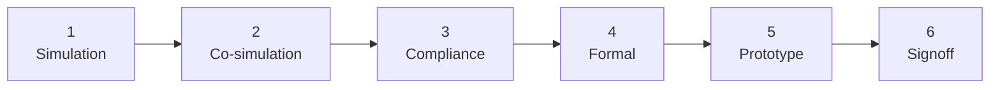

# 06 — Verification Requirements

> [!NOTE]
> **§§1–8 are requirements.**
> **[§9](#9-reference-verification-strategy) is reference guidance.**

**Contents:**
[1. The standard](#1-the-standard) ·
[2. A benchmark is not a gate](#2-a-benchmark-is-not-a-gate) ·
[3. Simulation and co-simulation](#3-simulation-and-co-simulation) ·
[4. Formal equivalence](#4-formal-equivalence) ·
[5. Compliance](#5-compliance) ·
[6. FPGA prototype](#6-fpga-prototype) ·
[7. Continuous integration](#7-continuous-integration) ·
[8. Signoff](#8-signoff) ·
[9. Reference verification strategy](#9-reference-verification-strategy)

---

## 1. The standard

This design is fabricated. A bug found after tapeout is not a bug fix, it is a
schedule and a budget. Verification is correspondingly stricter than for RTL
that only ever runs in simulation.

Verification is staged, and **each stage gates the next**.

| Stage | Gate |
|:--:|---|
| **1 — Simulation** | Every configuration builds and boots; directed and random tests pass |
| **2 — Co-simulation** | Instruction-by-instruction agreement with a reference model |
| **3 — Compliance** | Passes with handlers; failures without handlers documented |
| **4 — Formal** | Pruned core proven equivalent to baseline on the surviving subset |
| **5 — Prototype** | Full application runs at speed, closed-loop |
| **6 — Signoff** | Timing, DRC and LVS clean at target corners |

---

## 2. A benchmark is not a gate

A benchmark completing proves the core is not comprehensively broken. It is a
smoke test. It says nothing about the instructions the workload actually needs,
and nothing at all about the ones removed.

| ID | Requirement |
|:--:|---|
| **R-6.1** | No configuration MAY advance a stage on the strength of a benchmark completing. Each gate MUST be evidenced by its stated criterion. |

---

## 3. Simulation and co-simulation

| ID | Requirement |
|:--:|---|
| **R-6.2** | Every configuration MUST build and pass the regression suite. A configuration that only synthesises is not verified. |
| **R-6.3** | Co-simulation against a reference model MUST be run for every configuration. |
| **R-6.4** | Co-simulation MUST cover the emulation handlers, not just native instructions. |
| **R-6.5** | Stimulus MUST include the removed encodings, to confirm they trap as specified. |
| **R-6.6** | Functional coverage MUST be collected and reported per configuration. |

> **On R-6.5.** The most valuable stimulus for a pruned core is the instructions
> it no longer implements. Testing only what remains verifies the part you did
> not change.

---

## 4. Formal equivalence

| ID | Requirement |
|:--:|---|
| **R-6.7** | Each pruned configuration MUST be formally proven equivalent to the baseline **on the surviving subset**. |
| **R-6.8** | The assumption set MUST be stated explicitly, and MUST itself be justified. |
| **R-6.9** | Any property that cannot be proven MUST be listed, with the bounded-verification argument used instead. |
| **R-6.10** | Equivalence MUST be re-established after every RTL change, in CI. |

> **On R-6.8.** The proof is conditional on the decoder never seeing a removed
> opcode — exactly what the compatibility contract in
> [`05`](05-compatibility-requirements.md) discharges. The formal argument and
> the handlers are two halves of one claim, and an unstated assumption here
> silently voids the result.

> **On R-6.9.** Full equivalence on a pipelined core with caches may not close.
> Saying so, and stating what was proven instead, is a stronger position than a
> green tick over an unstated bound.

---

## 5. Compliance

| ID | Requirement |
|:--:|---|
| **R-6.11** | Compliance MUST be run with handlers installed; the configuration MUST pass. |
| **R-6.12** | It MUST also be run without handlers; every failure MUST be documented and mapped to a specific removal. |
| **R-6.13** | Both results MUST be published together. |

---

## 6. FPGA prototype

| ID | Requirement |
|:--:|---|
| **R-6.14** | The full application MUST run on an FPGA prototype before RTL freeze, with real sensors in the loop. |
| **R-6.15** | The closed-loop latency and jitter of R-2.12 and R-2.13 MUST be measured on the prototype and used to validate the pre-silicon model. |
| **R-6.16** | The prototype MUST exercise the emulation handlers under realistic interrupt load. |

> **On R-6.15 and R-6.16.** The prototype is the last opportunity to discover
> that the latency budget does not close, and the only place handler correctness
> under interrupt load is genuinely exercised. Finding a problem there costs a
> configuration re-spin; finding it after fabrication costs the tapeout.

---

## 7. Continuous integration

| ID | Requirement |
|:--:|---|
| **R-6.17** | CI MUST gate every merge on the full set of verification stages that can run automatically. |
| **R-6.18** | A configuration failing any gate MUST NOT be merged. |
| **R-6.19** | CI MUST record tool versions and source commits for every run, satisfying R-1.6. |

> **On R-6.17.** Verification that runs when someone remembers stops running
> around the time the schedule gets tight — which is when it starts to matter.

---

## 8. Signoff

| ID | Requirement |
|:--:|---|
| **R-6.20** | Timing MUST close at all specified corners, with margin recorded. |
| **R-6.21** | Physical verification MUST be clean. |
| **R-6.22** | Power MUST be analysed for both the always-on and the duty-cycled domains, including the wake transition. |
| **R-6.23** | A signoff checklist MUST be completed and archived with the submission. |
| **R-6.24** | Test, debug access and a bring-up plan MUST exist before submission. |

> **On R-6.24.** A chip you cannot debug is a chip you cannot bring up. Decide
> how internal state will be observed on silicon while the logic to do it can
> still be added.

---

## 9. Reference verification strategy

> [!NOTE]
> **Reference guidance.** One way to satisfy §§1–8.

### 9.1 The characteristic bug of this project

> [!CAUTION]
> A removed instruction whose decode arm is deleted may still **match a
> different arm**. Priority-encoded decoders are full of don't-care bits, and
> deleting one branch can widen another. The instruction does not trap — it
> executes as something else, silently, with plausible-looking results.
>
> This is the bug that reaches silicon, because every test exercising the
> *surviving* ISA passes.

For every removed encoding, assert that it raises an illegal-instruction
exception, and generate that test set mechanically from the subset manifest so
it cannot drift from the configuration (R-6.5).

### 9.2 Plan for a partial formal result

The proof is *pruned core ≡ baseline core, given the decoder never observes a
removed opcode* — an assumption discharged by the compatibility contract, and
one to state explicitly (R-6.8).

Expect full equivalence on a pipelined core with caches not to close with open
tooling ([`11`](11-expected-results-and-risks.md), P-6). Prove what closes,
fall back to bounded checking elsewhere and state the bound, and list every
unproven property. A precisely-bounded proof is a legitimate contribution; an
unbounded green tick is not. Time-box the effort — equivalence checking will
absorb whatever it is given.

### 9.3 Handler verification

The handler library needs verification separate from the core's: against a
reference model, exhaustively where the input space allows; on the
architecturally-specified edge cases that are *not* traps; and under nesting and
realistic interrupt load on the prototype, where unit tests do not reach the
rare interleavings.

### 9.4 One CI gate the requirements do not name

Re-run the subsetting pipeline on every toolchain change. A compiler upgrade can
emit an instruction the analysis never saw, silently invalidating the subset —
and the failure mode is a hang in the field rather than a red build.

### 9.5 What to measure on the prototype

Worst-case closed-loop latency and **jitter** (R-2.13), under realistic
interrupt load, with handlers installed, for long enough that rare interleavings
occur. Report the distribution, not the mean: the thesis is a determinism claim,
and the mean conceals the tail it depends on.

---

| ← Previous | Index | Next → |
|---|:---:|---|
| [`05 — Compatibility Requirements`](05-compatibility-requirements.md) | [`README`](../README.md) | [`07 — Implementation Constraints`](07-implementation-constraints.md) |
