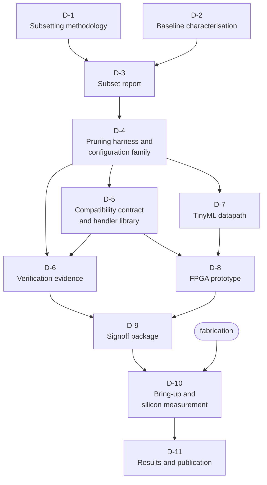

# 08 — Deliverables

The artifacts the work must produce. **No dates:** sequencing follows the
dependencies below; scheduling is the team's own.

---

## The deliverables

| ID | Artifact | What it must contain | Depends on |
|:--:|---|---|---|
| **D-1** | **Subsetting methodology** | The deletion criterion and its soundness argument, the classification granularity, the evidence pipeline and manifest format, the configuration family the method produces, and the method's stated limits. | — |
| **D-2** | **Baseline characterisation** | The unmodified core fully characterised, with the configuration it was measured in; comparison cores under the same flow; both workload corpora built and running. | — |
| **D-3** | **Subset report** | Every encoding classified under the D-1 criterion with traceable evidence, coverage statistics, quantified over-approximation, regenerable from the manifest. | D-1, D-2 |
| **D-4** | **Pruning harness and configuration family** | Parameterised configurations, each buildable, composable, reversible and traced to its criterion; per-configuration deltas, **including those that saved nothing**. | D-3 |
| **D-5** | **Compatibility contract and handler library** | Handlers for every removed encoding as a linkable library; cost data and measured whole-program slowdown; the contract document, including behaviour when handlers are absent; the real-time-path analysis. | D-4 |
| **D-6** | **Verification evidence** | Regression and co-simulation results per configuration; compliance results **both** with and without handlers; formal equivalence results with assumptions and unproven properties stated; the CI configuration enforcing the gates. | D-4, D-5 |
| **D-7** | **TinyML datapath** | The coprocessor and its software stack, with dimensions derived from the measured area budget and throughput stated in cycles; energy results against the D-2 baseline. | D-4 |
| **D-8** | **FPGA prototype** | The full application closed-loop on real sensors; measured latency and jitter validating the pre-silicon model; handlers exercised under interrupt load. | D-5, D-7 |
| **D-9** | **Signoff package** | Timing, physical verification and power results; completed checklist; bring-up, test and debug plan; the generated manifest. | D-6, D-8 |
| **D-10** | **Bring-up and silicon measurement** | The packaged part on its board and airframe; measured throughput against power; measured closed-loop latency and jitter on silicon, compared against the pre-silicon predictions **including where they disagree**. | D-9, fabrication |
| **D-11** | **Results and publication** | The ISA-coverage-versus-PPA curve, the XLEN scaling study, comparison against all baselines, and how the recorded predictions fared. | D-10 |

---

## Two deliverables that deserve a note

**D-1 comes before any RTL.** A pruning branch that precedes a stated criterion
cannot be justified afterwards — the reasoning gets reconstructed to fit
decisions already made, and that is visible to a reader.

**D-11 depends on predictions recorded in advance.** Record them before
measuring and publish them unchanged. A results section where every prediction
was confirmed reads as a study that was never at risk of being wrong; on a
project whose contribution is a method, evidence that the method could surprise
its authors is what makes it credible. See
[`11-expected-results-and-risks.md`](11-expected-results-and-risks.md) for the
predictions already committed.

---

| ← Previous | Index | Next → |
|---|:---:|---|
| [`07 — Implementation Constraints`](07-implementation-constraints.md) | [`README`](../README.md) | [`09 — Acceptance Criteria`](09-acceptance-criteria.md) |
