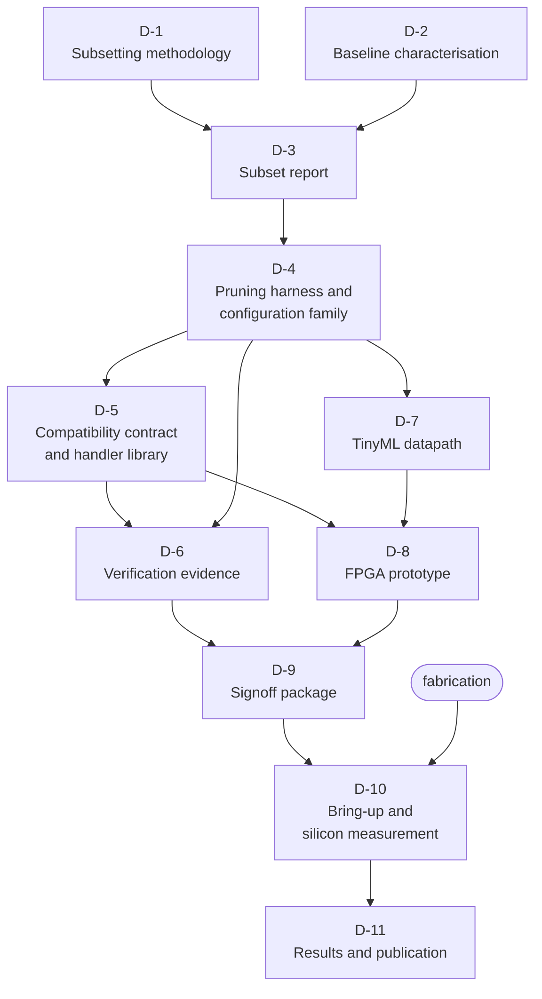

# 08 — Deliverables

Artifacts the team produces. **No dates:** sequencing follows the dependencies
below, and scheduling is the team's own.

## Dependency graph

**Status legend:** the checklists below are the acceptance content of each
deliverable — tick them as evidence lands.

---

## D-1 — Subsetting methodology

*The first deliverable, and the one everything else depends on.*

- [ ] The deletion criterion, stated formally, with its soundness argument (R-4.1–R-4.5)
- [ ] Classification granularity and justification (R-4.11, R-4.12)
- [ ] Evidence pipeline and manifest format (R-4.6–R-4.10)
- [ ] The configuration family the method produces
- [ ] Stated limitations and non-applicability conditions

| Depends on | Blocks |
|---|---|
| *nothing* | **everything** |

> [!IMPORTANT]
> Produce this **before touching RTL**. A pruning branch that precedes a stated
> criterion cannot be justified afterwards — the reasoning gets reconstructed to
> fit decisions already made, and reviewers can tell.

---

## D-2 — Baseline characterisation

- [ ] Unmodified CVA6, fully characterised: area, power, timing, and the complete
      configuration it was measured in (R-3.1–R-3.3)
- [ ] Ibex and X-HEEP baselines under the same flow (R-2.23)
- [ ] Corpus A and Corpus B workloads built and running

| Depends on | Blocks |
|---|---|
| *nothing* | every comparative claim |

---

## D-3 — Subset report

- [ ] `isaprof` (or substitute) results across Corpus B
- [ ] Classification of every encoding under the D-1 criterion, with evidence
- [ ] Coverage statistics and over-approximation quantified (R-4.5)
- [ ] Regenerable from the manifest (R-4.7–R-4.9)

| Depends on | Blocks |
|---|---|
| D-1, D-2 | D-4 |

---

## D-4 — Pruning harness and configuration family

- [ ] Parameterised configurations layered over CVA6's existing mechanism (R-3.4)
- [ ] Each independently buildable, composable and reversible (R-3.5–R-3.7)
- [ ] Each traced to its criterion (R-3.9)
- [ ] Per-configuration area and power deltas, **including those that saved
      nothing** (R-3.12, R-4.18)

| Depends on | Blocks |
|---|---|
| D-3 | D-5, D-6, D-7 |

---

## D-5 — Compatibility contract and handler library

- [ ] M-mode handlers for every removed encoding (R-5.1)
- [ ] Linkable library, not runtime-embedded (R-5.3)
- [ ] Per-instruction cost table (R-5.9) and measured whole-program slowdown (R-5.10)
- [ ] Contract document, including behaviour when handlers are absent (R-5.16–R-5.18)
- [ ] Real-time-path analysis (R-5.12)

| Depends on | Blocks |
|---|---|
| D-4 | D-6, D-8 |

---

## D-6 — Verification evidence

- [ ] Regression results per configuration (R-6.2)
- [ ] Co-simulation results, including handlers (R-6.3, R-6.4)
- [ ] RISCOF results **both** with and without handlers (R-6.11–R-6.13)
- [ ] Formal equivalence results, with assumptions and unproven properties stated (R-6.7–R-6.9)
- [ ] CI configuration enforcing the gates (R-6.17)

| Depends on | Blocks |
|---|---|
| D-4, D-5 | **D-9** |

---

## D-7 — TinyML datapath

- [ ] CV-X-IF coprocessor, custom opcode space (R-3.13, R-3.14)
- [ ] Dimensions derived from the measured area budget (R-3.15)
- [ ] Throughput in cycles, including fill and drain (R-3.16)
- [ ] Software stack: quantised runtime with kernels mapped to the extension
- [ ] Energy results against the D-2 baseline

| Depends on | Blocks |
|---|---|
| D-4 | D-8 |

---

## D-8 — FPGA prototype

- [ ] Full application, real sensors, closed loop (R-6.14)
- [ ] Measured latency and jitter, validating the pre-silicon model (R-6.15)
- [ ] Handlers exercised under interrupt load (R-6.16)

| Depends on | Blocks |
|---|---|
| D-5, D-7 | D-9 |

---

## D-9 — Signoff package

- [ ] Timing, DRC, LVS, power (R-6.20–R-6.22)
- [ ] Completed signoff checklist (R-6.23)
- [ ] Bring-up plan, scan and debug access (R-6.24)
- [ ] Generated manifest (R-7.21, R-7.22)

| Depends on | Blocks |
|---|---|
| D-6, D-8 | D-10 |

---

## D-10 — Bring-up and silicon measurement

- [ ] Daughterboard, mounted on a drone frame
- [ ] Measured FPS against milliwatts (R-2.19)
- [ ] Measured closed-loop latency and jitter on silicon (R-2.20)
- [ ] Silicon results compared against pre-silicon predictions, **including where
      they disagree**

| Depends on | Blocks |
|---|---|
| D-9, and fabrication | D-11 |

---

## D-11 — Results and publication

- [ ] The ISA-coverage-versus-PPA curve (R-2.22, R-4.17)
- [ ] The XLEN scaling study (R-3.18, R-3.19)
- [ ] Comparison against all baselines (R-2.23)
- [ ] Predictions recorded before measurement, and how they fared

| Depends on | Blocks |
|---|---|
| D-10 | — |

---

## A note on D-11

> [!IMPORTANT]
> Record predictions **before** measuring, and publish them unchanged afterwards.
>
> A results section where every prediction was confirmed reads as a study that was
> never at risk of being wrong. The disagreements are the most informative part of
> the work, and on a project whose contribution is a *method*, evidence that the
> method was capable of surprising its authors is what makes the method credible.

See [`11-expected-results-and-risks.md`](11-expected-results-and-risks.md) for
the predictions already committed.

---

| ← Previous | Index | Next → |
|---|:---:|---|
| [`07 — Implementation Constraints`](07-implementation-constraints.md) | [`README`](../README.md) | [`09 — Acceptance Criteria`](09-acceptance-criteria.md) |
