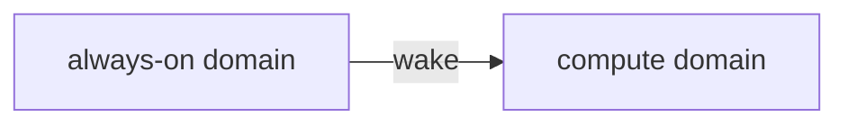

# `docs/figures/`

Diagram sources. **Keep the source here, not only the export.**

> [!TIP]
> Prefer Mermaid in fenced `mermaid` blocks inside the documents themselves —
> GitHub renders it, and it stays diffable. Use this directory for diagrams too
> large to inline, or for exports needed by a paper.

````markdown

````

> [!WARNING]
> Commit the source alongside any exported image. A PNG whose source has been
> lost cannot be corrected when the design changes, and **on this project the
> block diagram will change.**

## Figures likely to be needed

| Figure | Reference |
|---|---|
| SoC block diagram: always-on domain, compute domain, CV-X-IF attachment, memory, power domains | [`02`](../02-application-requirements.md) §9.2 |
| The ISA-coverage-versus-PPA curve — **the project's primary figure** | R-2.22 |
| Sensor-to-PWM latency budget allocation | R-2.14 |
| Trap-and-emulate control flow, for the compatibility contract | [`05`](../05-compatibility-requirements.md) §7.1 |

---

[`README`](../../README.md) · [`docs/`](../)
