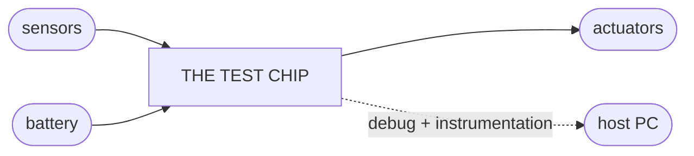
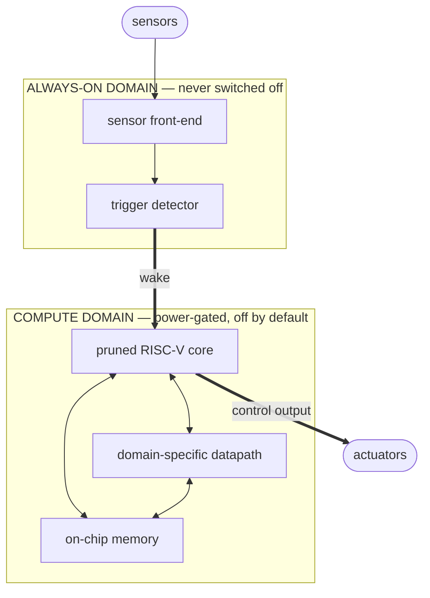
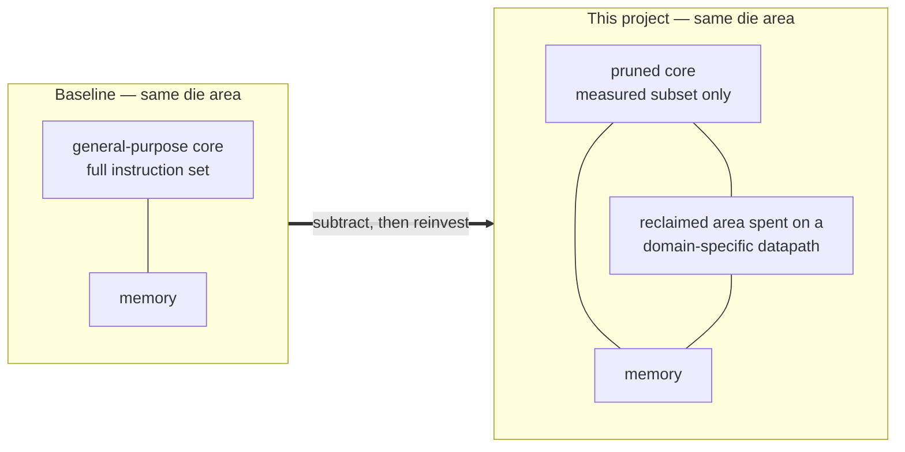
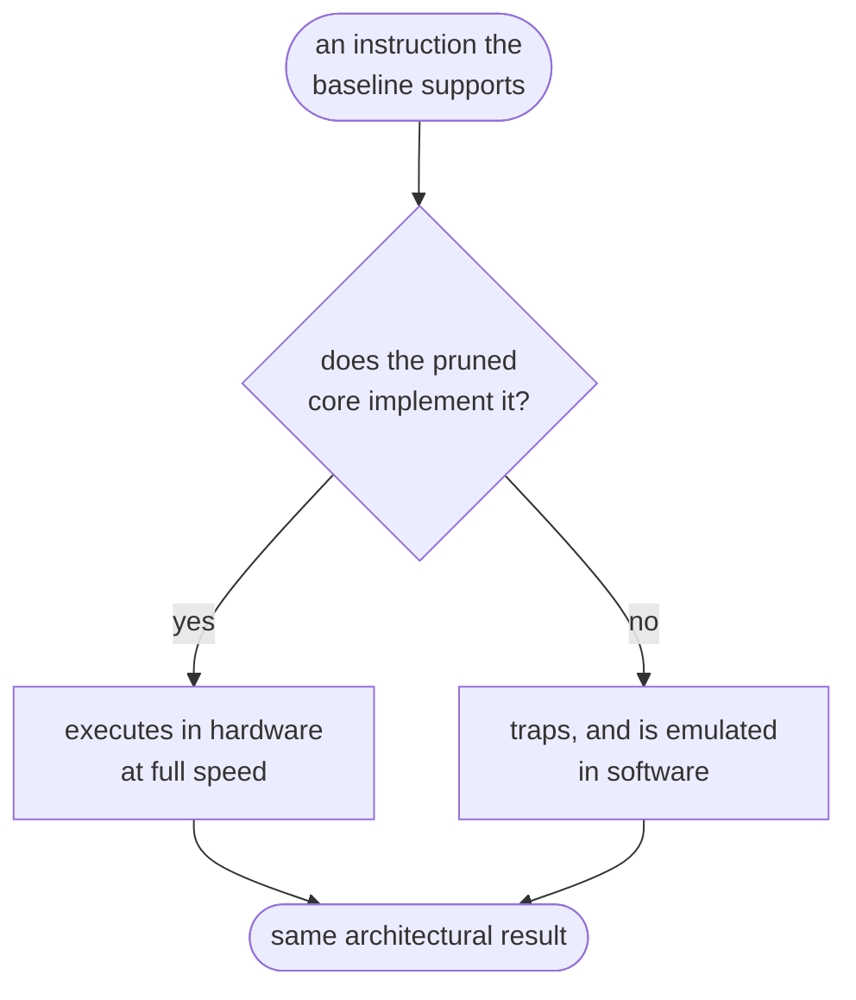
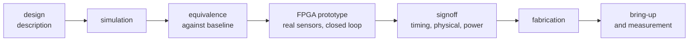
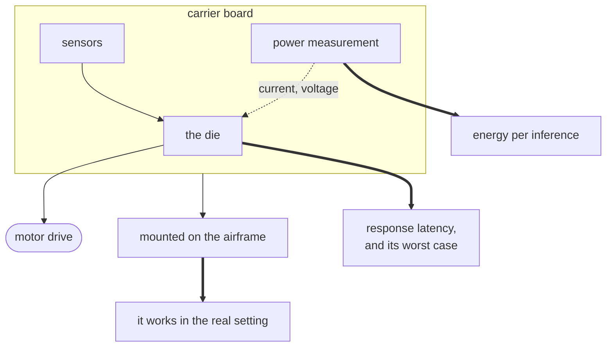

# Objective O-6 — The Test Chip, Visually

> **O-6.** Carry one configuration through to a fabricated, measured test chip
> in an always-on edge perception application.

This page is illustrative. It shows *what the pieces are and how they relate*,
so the objective is easier to picture. It does not prescribe an implementation —
the architecture, the interfaces and the numbers are all still open.

**Contents:**
[1. What gets fabricated](#1-what-gets-fabricated) ·
[2. The idea in one picture](#2-the-idea-in-one-picture) ·
[3. Inside the compute domain](#3-inside-the-compute-domain) ·
[4. From source to silicon](#4-from-source-to-silicon) ·
[5. Measuring the finished part](#5-measuring-the-finished-part) ·
[6. Component inventory](#6-component-inventory)

---

## 1. What gets fabricated

A single small die, mounted on a carrier board, running one application without
an operating system underneath it. Sensors feed it; motors are driven from it;
everything it computes on lives in on-chip memory.

The dashed link matters as much as the solid ones: a part you cannot observe is
a part you cannot bring up.

---

## 2. The idea in one picture

The chip is split into two power domains. A very small always-on domain watches
the sensors continuously; the larger compute domain is switched off until it is
needed, wakes, does the work, and switches off again.

Why this shape serves the objective:

| Element | Why it is there |
|---|---|
| **Always-on domain** | The device must react to the world without being asked. Keeping this part tiny is what makes "always-on" affordable. |
| **Power gating** | The compute domain spends most of its life switched off. Energy per event, not energy per second, is the figure of merit. |
| **On-chip memory only** | Going off-chip for weights would cost more energy than the computation itself, and would require analogue interfaces outside the scope of a first tapeout. |

---

## 3. Inside the compute domain

This is where the project's thesis becomes visible. The baseline core implements
a general-purpose instruction set. The pruned core implements only what the
workload needs — and the area that frees is spent on a datapath that does the
application's arithmetic directly.

**The claim is not "we made it smaller".** It is that the same silicon budget,
spent differently, does the application's work using less energy — while still
executing any instruction the baseline could, by emulating in software whatever
the hardware no longer implements.

That second path is what keeps the part a legal implementation from software's
point of view. It costs time, not correctness.

---

## 4. From source to silicon

O-6 is the objective that turns a design into a physical object, and each stage
below has to be passed before the next one means anything.

The FPGA prototype is the last point at which a problem is cheap. After
fabrication, the cost of a mistake is the tapeout.

---

## 5. Measuring the finished part

A chip that works is not yet a result. The result is the measurement, taken in
the application it was built for.

| What is measured | Why it is the interesting number |
|---|---|
| **Energy per inference** | The whole reinvestment argument reduces to this. |
| **Worst-case response latency** | An average hides exactly the behaviour a control loop cannot tolerate. |
| **Silicon against prediction** | Where the measurement disagrees with what was expected is the most informative part of the result. |

---

## 6. Component inventory

Everything O-6 requires someone to have built, obtained or arranged:

| | Component | Notes |
|:--:|---|---|
| **Silicon** | Pruned core | The output of O-1 to O-4 |
| | Domain-specific datapath | The output of O-5 |
| | On-chip memory | Sized to the application, not to a round number |
| | Always-on front-end and trigger | The part that is never switched off |
| | Power gating and domain control | Where duty-cycled designs most often fail |
| | Debug and test access | Decide this while the logic can still be added |
| **Software** | Boot and initialisation | Runs before anything else, including emulation setup |
| | Emulation handlers | Whatever the hardware no longer implements |
| | The application itself | Perception, plus the control loop |
| **Hardware** | Carrier board | Die, sensors, power instrumentation |
| | Sensors and actuators | The real ones, not stand-ins |
| | The platform | Where the part is finally judged |
| **Process** | Fabrication slot | A shared multi-project run; the schedule is not yours |
| | Packaging and assembly | Between "tape out" and "hold a chip" |
| | Bring-up plan | Written before the part arrives, not after |

---

[`README`](../README.md)
