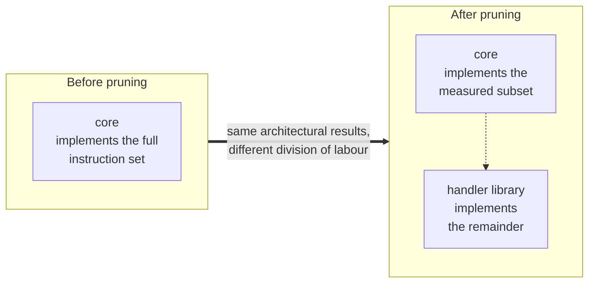
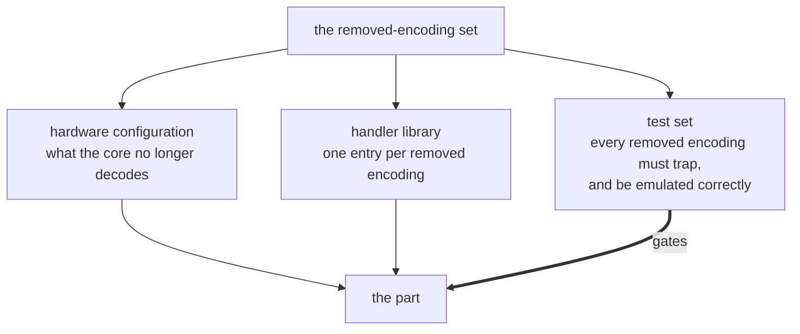
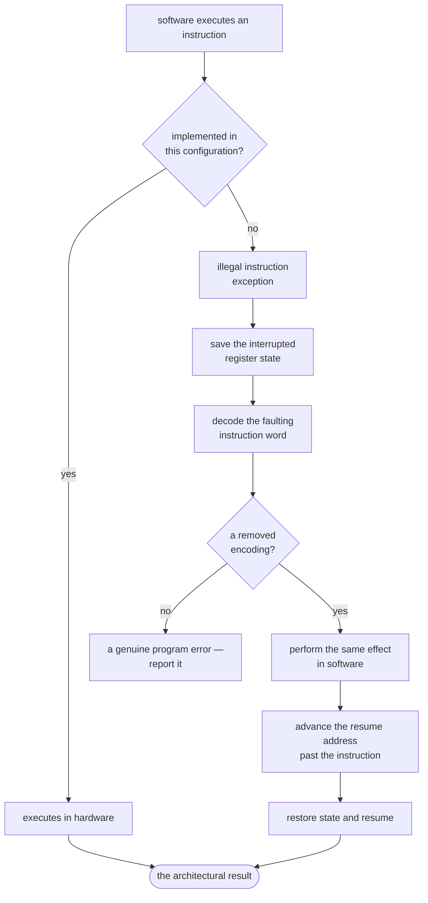
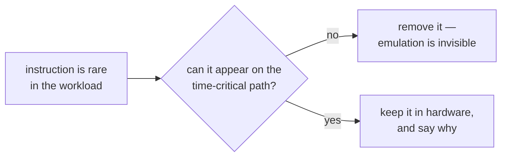

# Pruning and Bridging — What Can Go, and What Happens When It Does

Two questions sit at the centre of this project:

1. **What can be removed** from a general-purpose core that a fixed-function
   device never needs?
2. **How the trimmed processor still supports the same functionality** — when a
   library, a bring-up test or a recompiled binary executes something the
   hardware no longer implements.

The second question is the interesting one. Removing hardware is easy; removing
it while the software carries on working is the contribution. This brief sets
out what may go, what guarantee replaces it, and what that guarantee costs.

> Illustrative throughout. The candidates below are examples of the *kinds* of
> thing a measurement might identify, not a list to implement, and the cycle
> figures are made up to show the shape of the arithmetic.

The candidates are drawn from the device in
[`objective-6-test-chip.md`](objective-6-test-chip.md): **one application, one
hart, quantised arithmetic, everything in on-chip memory, and a control loop
with a deadline.** A different device would prune a different list — which is
exactly why the decision has to come from measuring the workload rather than
from taste.

**Contents:**
[1. What can be pruned](#1-what-can-be-pruned) ·
[**2. What "the same functionality" means**](#2-what-the-same-functionality-means) ·
[3. The mechanism](#3-the-mechanism) ·
[4. What the bridge costs](#4-what-the-bridge-costs) ·
[5. When not to bridge](#5-when-not-to-bridge)

Worked examples — three removals followed through in handler code, and the
mistakes that spoil them — are in the companion annex,
[`pruning-and-bridging-annex.md`](pruning-and-bridging-annex.md).

---

## 1. What can be pruned

Candidates fall into two groups, and the difference between them decides whether
any bridging is needed at all.

### Software-visible — removing it changes what the ISA can execute

Every row here needs a bridge.

| Candidate | Example | Why it is a candidate *on this device* |
|---|---|---|
| **A whole extension** | Floating point | The models are quantised end to end, so no floating-point arithmetic appears in the workload |
| | Atomics | One hart, one application, no other agent to race against |
| **Individual instructions within an extension** | Integer divide and remainder, keeping multiply | Inference is multiply-accumulate. Division being rare is a *hypothesis to measure*, not a given — see [§5](#5-when-not-to-bridge) |
| **Subsets of an encoding** | Compressed forms the workload never contains | A single bare-metal image exercises a narrow slice of the encoding space |
| **Control and status registers** | Counters, or privileged state the application never reads | No operating system underneath, so most privileged state goes untouched |
| **Optional behaviour** | Hardware support for misaligned loads and stores | Packed sensor frames are the main source, and software can cover them |

### Not software-visible — removing it changes only speed, area or power

None of these need a bridge: the software cannot tell.

| Candidate | Example | Why it is a candidate *on this device* |
|---|---|---|
| **Structural sizing** | Fewer scoreboard entries; smaller caches, branch predictor or return-address stack | The working set is knowable, because there is only ever one application |
| **Implementation strategy** | An iterative multiplier in place of a single-cycle one | Changes how long the answer takes, not what the answer is |
| **Address translation** | Removing an unused memory-management unit | Nothing to translate — and page-walk jitter would threaten the control-loop deadline anyway |
| **Verification-only interfaces** | Trace ports used for co-simulation but not shipped | Needed to *verify* the part, not to run it. Distinct from the debug access the chip keeps for bring-up |

The second group is where much of the area usually is, and it costs nothing in
compatibility. The first group is where the project's claim lives: **you may
remove it, provided you can still execute it.**

---

## 2. What "the same functionality" means

The claim the project makes is precise, and worth stating before any mechanism:

> **For every instruction the baseline core could execute, the pruned part
> produces the same architectural result.** Some of that behaviour is
> implemented in hardware and the remainder in software, and the division
> between them is invisible to the program — except in how long it takes.

The important word is *part*. What is functionally equivalent to the original
core is not the pruned core on its own; it is **the pruned core together with
its handler library.** Neither half is a complete implementation.



Setting the two side by side:

| Property | Before pruning | After pruning |
|---|---|---|
| Result of any instruction the baseline supported | as specified | **identical** |
| Does existing software need recompiling? | — | **no** |
| Which instructions run at full hardware speed | all of them | the measured subset |
| What the rest cost | hardware latency | trap, emulate, resume |
| Gates spent implementing the rest | permanent silicon | none |

### The equivalence rests on three conditions

| | Condition | If it fails |
|:--:|---|---|
| **1** | **Coverage.** *Every* removed encoding has a handler — not most of them. | Some instruction takes an illegal-instruction trap that nothing services, and the program dies. |
| **2** | **Fidelity.** Each handler reproduces the architectural effect exactly, side effects included. | The part is no longer a legal implementation, and the divergence surfaces as a mysterious bug much later. |
| **3** | **Presence.** Handlers are installed before any application code runs — and if they are missing, the part fails cleanly rather than silently. | A binary runs without cover and produces wrong answers instead of an error. |

Condition 2 is what the worked examples in the
[annex](pruning-and-bridging-annex.md) are about. Condition 1 is what makes
those examples add up to a guarantee, and it is worth its own paragraph.

### How coverage is guaranteed

The subsetting method produces exactly one artefact that matters here: **the set
of removed encodings.** Everything downstream is generated from that one list.



Because the hardware configuration, the handler library and the tests all derive
from the same list, they cannot drift apart. Remove something from the hardware
without writing its handler and the generated test fails — before the design
reaches silicon, where the mistake would be permanent.

### Instructions the workload never used

A subtlety that decides how complete "the same functionality" really is.

The measurement says which instructions the analysed program *can* execute.
Anything outside that set was absent from **the program that was analysed** — it
was never absent from **the instruction set**. The part may still meet it: a
bring-up test, a third-party binary, or the same source recompiled by a newer
toolchain that emits something the original never did.

So a removed encoding gets a handler **whether or not the workload was ever seen
to use it**. There are two verdicts, not three: an instruction is either
implemented in hardware, or implemented in software. "Not present" is not a
third option, because it is a statement about one binary rather than about the
part.

---

## 3. The mechanism

So much for the guarantee. The mechanism that delivers it is a single hardware
behaviour: when the core no longer implements an encoding, executing it raises
an **illegal instruction** exception rather than doing something undefined. That
exception is the hand-off from hardware to software.



The handler needs three things from the trap: **which instruction faulted**
(available from the trap cause registers, or by reading memory at the saved
address), **the register state at the point of the fault** (saved on entry), and
**where to resume** (the saved address, advanced past the instruction).

Everything the instruction was supposed to do — write a register, update memory,
set a flag — the handler does instead, to the *saved* state. When it returns,
the program cannot tell the difference except by measuring time.

That is the whole mechanism. What it looks like for a real removal — an
arithmetic instruction, an atomicity guarantee, and a structural feature — is
followed through in the [annex](pruning-and-bridging-annex.md).

---

## 4. What the bridge costs

Emulation is a compatibility guarantee, not a performance one. The cost has a
fixed part (trap, save, decode, restore, return) and a variable part (doing the
work in software).

Suppose — purely to show the shape of the calculation — that a hardware divide
takes ~20 cycles and its emulated equivalent ~200 including trap overhead, and
that the workload spends 0.1% of its executed instructions on division:

```
  slowdown  =  frequency  x  (emulated cost - hardware cost)
            =  0.001      x  (200 - 20)
            =  ~0.18 cycles per instruction added
```

Small — because the instruction was removed *precisely because it is rare*.
That is the general result: **whole-program cost stays low when removal is
driven by measurement.**

Two cautions on that arithmetic:

- **It has to be measured, not summed.** Trap overhead interacts with pipeline
  and cache state, so a table of per-instruction costs understates the real
  figure.
- **Averages hide the tail.** The next section is about the tail.

---

## 5. When not to bridge

Bridging guarantees an instruction **works**. It does not guarantee it works
**in time**.



On a device whose value is a bounded response time, an unbounded trap in the
control loop is not a small slowdown — it is a failure of the thing the product
sells. Some instructions therefore stay in hardware even though the subset says
they could go.

**Division is the example to watch on this device.** It is plausibly rare across
the workload as a whole, which is what makes it a candidate — and control loops
and sensor normalisation are exactly the places it tends to survive. If the
measurement puts a divide inside the sensor-to-actuator path, then the
whole-program arithmetic of [§4](#4-what-the-bridge-costs) is the wrong test to
apply to it, and the right answer is to keep the divider and record why.

A retained instruction with a documented latency justification is a stronger
result than a removed one that breaks the timing guarantee: identifying it
quantifies where the hardware/software boundary genuinely cannot move.

---

[`README`](../README.md) · [`pruning-and-bridging-annex.md`](pruning-and-bridging-annex.md) · [`objective-6-test-chip.md`](objective-6-test-chip.md)
