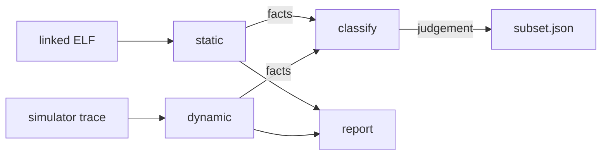

# isaprof

[](#)
[](#why-it-has-no-dependencies)
[](#tests)

Measures which RISC-V instructions a workload **can** execute and which it
**does** execute, and classifies them under the reference policy. It is the
instrument the CARVE-V subsetting work is built on.



> [!IMPORTANT]
> `static` and `dynamic` **measure**; `classify` **judges**. They live in separate
> modules, and a test enforces that, because the policy is expected to be replaced
> and replacing it must not require touching the measurement. The policy is
> documented in [`docs/04-methodology-requirements.md`](../../docs/04-methodology-requirements.md) §9.

**Contents:**
[Why no dependencies](#why-it-has-no-dependencies) ·
[The two passes](#the-two-passes) ·
[Usage](#usage) ·
[Reading the output](#reading-the-output) ·
[Coverage](#coverage) ·
[Tests](#tests)

---

## Why it has no dependencies

No `pip install` of third-party packages, no RISC-V toolchain, no `objdump`,
no `pytest`. It ships its own ELF reader and its own RISC-V decoder and runs on
a bare Python 3.9+ install.

> [!NOTE]
> A measurement tool that first requires a working cross-toolchain is a
> measurement tool that gets run once, by one person, on one machine. Every
> number in this project traces back to this tool, so it has to run everywhere,
> including in CI and on a laptop the day someone joins the team.

---

## The two passes

| | `static` | `dynamic` |
|---|---|---|
| **Question** | What *can* execute? | What *did* execute, how often? |
| **Input** | Linked ELF | Simulator trace |
| **Counts** | Occurrences in the image | Executions |
| **Bias** | Over-approximates | Under-approximates |
| **Valid use** | Bounding what hardware must support | Ranking what to accelerate; costing emulation |

> [!CAUTION]
> **These are not interchangeable, and the difference is the point.** The static
> pass over-approximates on purpose: it decodes constant pools and jump tables
> that share a section with code, because including something harmless is safe
> while excluding something reachable is not. The dynamic pass under-approximates
> just as fundamentally — absence from a trace means "this run didn't reach it",
> never "this cannot be reached".

The fixture suite pins this down: `ecall` is present in `sample.elf` and absent
from `spike_trace.log`. A dynamic-only view would have missed it entirely.

---

## Usage

**What can execute?**

```bash
python3 -m isaprof static firmware.elf --json static.json --top 20
```

**What did execute?** Accepts Spike `-l` / `--log-commits` output, or a plain
hex-per-line histogram from a QEMU TCG plugin.

```bash
python3 -m isaprof dynamic spike.log --xlen 32 --json dynamic.json
```

**Render both, side by side.**

```bash
python3 -m isaprof report static.json dynamic.json -o report.md
python3 -m isaprof report static.json dynamic.json --format html -o report.html
```

**Apply the reference policy** — reachability decides, frequency prices.

```bash
python3 -m isaprof classify static.json dynamic.json -o subset.json
```

Installing it as a command is optional: `pip install -e .` then `isaprof ...`.

### `classify` fails safe

> [!WARNING]
> Run it **without** a dynamic profile and **everything reachable is kept**. With
> no trace, "executed zero times" is not an observation — it is the absence of
> one, and treating it as evidence is the mistake the whole method exists to
> prevent. The safe answer is also a useless one: nothing can be priced. **Supply
> a trace.**

Adopting this policy unmodified is permitted but is a *decision*
([R-4.22](../../docs/04-methodology-requirements.md#7-the-instrument)). Its
real-time-critical instruction list encodes assumptions about the interrupt
paths; check them against your actual workload.

---

## Reading the output

Two numbers deserve attention before any others.

| Signal | Pass | What it tells you |
|---|:--:|---|
| **Undecodable rate** | `static` | A linear sweep cannot tell code from data. **Above roughly 5%**, the swept sections carry substantial embedded data and the distinct-mnemonic count is not yet trustworthy — narrow the region list first. The tool says so itself when the threshold is crossed rather than leaving you to notice. |
| **Lines matched** | `dynamic` | If a trace parses to **zero** matched lines, the format is wrong, not the workload. |

Encodings are extracted from the trace and re-decoded with the same decoder the
static pass uses, so the two passes always name instructions identically —
otherwise comparing them would be meaningless exactly where comparison matters.

> [!TIP]
> Unrecognised encodings are reported as `unknown:<hex>`, **never dropped**. An
> unknown opcode in a binary you are about to build hardware for is a finding.

---

## Coverage

RV32/RV64 **I, M, A, F, D, C, Zicsr, Zifencei**, the machine and supervisor
privileged instructions, a working subset of **Zba/Zbb/Zbs**, and the four
custom opcode spaces (`custom-0` … `custom-3`) — which is how CV-X-IF
coprocessor instructions show up in a profile.

<details>
<summary><b>Width is enforced, not assumed</b></summary>

`ld` and `addiw` decode on RV64 and are **rejected** on RV32, and compressed
quadrant 1 `funct3=001` correctly reads as `c.jal` on RV32 and `c.addiw` on
RV64.

</details>

---

## Tests

```bash
python3 -m unittest discover -s tests -t .
```

**46 tests, no dependencies.** Fixtures are generated rather than pasted, so they
stay auditable — `tests/fixtures/make_fixtures.py` assembles each instruction
from its field encoding and states the expected mnemonic beside it. Regenerate
with:

```bash
python3 tests/fixtures/make_fixtures.py
```

> [!NOTE]
> `TestMeasurementPolicySeparation` is a **structural guard** rather than a
> correctness check: it fails if a measurement module ever imports the policy, or
> if a measurement profile ever carries a verdict.

---

[`README`](../../README.md) · [`docs/04 — Methodology Requirements`](../../docs/04-methodology-requirements.md)
